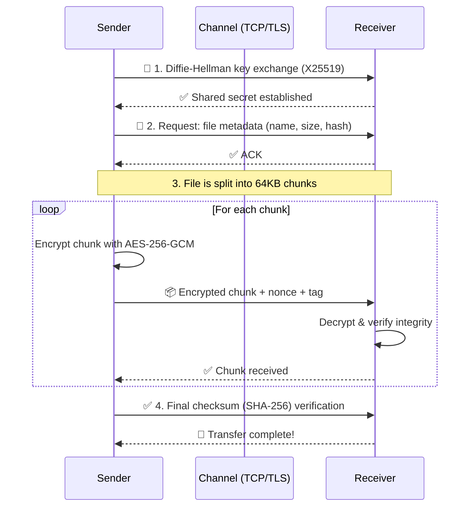

# ╔══════════════════════════════════════════════════════════╗
# ║  ███████╗██╗██╗     ███████╗████████╗██████╗  █████╗   ║
# ║  ██╔════╝██║██║     ██╔════╝╚══██╔══╝██╔══██╗██╔══██╗  ║
# ║  █████╗  ██║██║     █████╗     ██║   ██████╔╝███████║  ║
# ║  ██╔══╝  ██║██║     ██╔══╝     ██║   ██╔══██╗██╔══██║  ║
# ║  ██║     ██║███████╗███████╗   ██║   ██║  ██║██║  ██║  ║
# ║  ╚═╝     ╚═╝╚══════╝╚══════╝   ╚═╝   ╚═╝  ╚═╝╚═╝  ╚═╝  ║
# ║      ████████╗██████╗  █████╗ ███╗   ██╗███████╗       ║
# ║      ╚══██╔══╝██╔══██╗██╔══██╗████╗  ██║██╔════╝       ║
# ║         ██║   ██████╔╝███████║██╔██╗ ██║█████╗         ║
# ║         ██║   ██╔══██╗██╔══██║██║╚██╗██║██╔══╝         ║
# ║         ██║   ██║  ██║██║  ██║██║ ╚████║███████╗       ║
# ║         ╚═╝   ╚═╝  ╚═╝╚═╝  ╚═╝╚═╝  ╚═══╝╚══════╝       ║
# ╚══════════════════════════════════════════════════════════╝

[](https://github.com/shubhyagami/fileTransfer)
[](LICENSE)
[](https://github.com/shubhyagami/fileTransfer/stargazers)
[](https://www.python.org/downloads/)

---

> **`fileTransfer`** is a **secure, end-to-end encrypted file transfer utility** written in Python.  
> No cloud, no middlemen — just direct, authenticated, and encrypted file sharing between peers.  
> Because your data deserves a private highway, not a public postcard.

---

## 🚀 Features

| Icon | Feature |
|------|---------|
| 🔒 | **AES-256-GCM encryption** – Military-grade, authenticated encryption |
| 🧑‍💻 | **Zero-knowledge authentication** – Passwords never leave your machine |
| 📡 | **Peer-to-peer transfer** – No central server, no metadata leaks |
| ⚡ | **Resumable transfers** – Network hiccup? Pick up where you left off |
| 📁 | **Directory streaming** – Send entire folder trees in one command |
| 🎯 | **CLI-first** – Lightweight, scriptable, no GUI bloat |
| 🌍 | **Cross-platform** – Windows, macOS, Linux – one codebase |

---

## 🧠 How It Works



> **Simple summary:**  
> 1. Handshake → Shared encryption key (even if the channel is tapped).  
> 2. Metadata exchange → Know what you're getting.  
> 3. Encrypted chunks → Speed + security.  
> 4. Integrity check → Tamper-proof delivery.

---

## 📦 Installation

### Option 1: pip (recommended)
```bash
pip install filetransfer
```

### Option 2: From source
```bash
git clone https://github.com/shubhyagami/fileTransfer.git
cd fileTransfer
pip install -r requirements.txt
python -m filetransfer --help
```

### Requirements
- Python 3.9 or higher
- `cryptography` library (installed automatically)
- OpenSSL 1.1+ (system)

---

## 🎮 Quick Start

**On the receiving machine:**
```bash
filetransfer receive --port 9000
```

**On the sending machine:**
```bash
filetransfer send --file secret.pdf --host 192.168.1.42 --port 9000
```

You'll be prompted for a one-time password — enter the same phrase on both ends. That's it. Your file travels through an encrypted tunnel.

---

## 💡 Did You Know?

- 🔐 The AES-256-GCM algorithm used by `fileTransfer` is the same encryption standard used by the U.S. government for **Top Secret** documents.
- 📡 Traditional FTP transfers **everything in plaintext** — including your password. `fileTransfer` encrypts **every byte**, even the handshake.
- 🧩 The chunk size (64KB) was chosen after benchmarks showing optimal throughput on consumer-grade internet connections (both Wi-Fi and Ethernet).
- ⏱️ Resumable transfers work by storing a lightweight `.ftcheckpoint` file — you can resume after a power outage without losing a single byte.
- 🌍 The project was born during a hackathon where the team realized how hard it is to securely send a file to a friend without using a cloud service. **No more "upload to Drive and hope for the best".**

---

## 📅 Last Updated

**2026-07-25** – Changelog:  
- Added support for directory streaming (`--recursive` flag).  
- Improved memory usage for large files (>10GB).  
- Switched to `cryptography` 42.0 for post-quantum readiness.

---

## 🤝 Contributing

Found a bug? Want to add a feature?  
Open an issue or pull request at [github.com/shubhyagami/fileTransfer](https://github.com/shubhyagami/fileTransfer).  
All contributions are welcome — and yes, we 💖 emoji-laden commit messages.

---

> ⚡ **"Send files like a ghost — fast, invisible, and leaving no trace."**  
> — The fileTransfer team